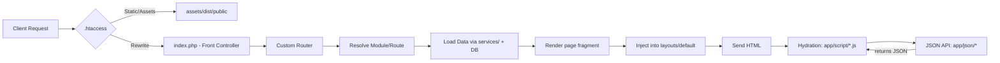

# STRUCTURE.md — SNEN / vc (Bilingue FR/EN)

> **FR** : Ce document décrit la structure du dépôt **previraza/vc**, le flux d’exécution et les rôles d’accès.  
> **EN** : This document explains the **previraza/vc** repository structure, the execution flow, and access roles.

---

## 1) Vue d’ensemble / Overview

**FR**  
- Application **PHP** monolithique avec **routeur personnalisé** (injection HTML dans le layout, récupération de scripts pour hydratation, et accès contrôlé aux ressources serveur).  
- Front basé sur HTML/CSS/JS ; PWA via `serviceWorker.js` et `ista.sw.js`.  
- Organisation **fonctionnelle** par modules (`admin/`, `registration/`, `check-resultat/`, `financy/`, `printer/`, etc.).  
- Base de données : **MySQL/MariaDB**.  
- Build front : pas d’outil imposé ; **Vite** peut être référencé si besoin.  

**EN**  
- **PHP** monolith with a **custom router** (HTML injection into layout, script retrieval for hydration, and controlled server resource access).  
- Frontend with HTML/CSS/JS; PWA via `serviceWorker.js` and `ista.sw.js`.  
- **Functional** modular organisation (`admin/`, `registration/`, `check-resultat/`, `financy/`, `printer/`, etc.).  
- Database: **MySQL/MariaDB**.  
- Front build: no enforced tool; **Vite** can be used if desired.

---

## 2) Arborescence / Repository tree (high-level)

```
vc/
├── .github/                 # CI/automation (si présent / if present)
├── admin/                   # Back-office / Admin module
├── app/                     # Noyau fonctionnel (pages, scripts, JSON API)
│   ├── pages/               # HTML fragments/pages rendus via layout
│   ├── script/              # JS côté client (hydratation, interactions)
│   ├── json/                # Endpoints JSON (API interne)
│   └── ...                  # Autres sous-dossiers fonctionnels
├── articles/                # Contenu éditorial / Articles
├── assets/                  # Sources front (CSS, JS, images, fonts)
├── check-resultat/          # Consultation publique des résultats
├── dist/                    # Build front (minifié) si applicable (Vite, etc.)
├── file-edit/               # Utilitaires d’édition de fichiers (restreindre accès)
├── financy/                 # Paiements, factures, rapports
├── layouts/
│   └── default/             # Layout(s) HTML : header/footer/slots
├── orientation/             # Module d’orientation
├── printer/                 # Templates d’impression (reçus, bulletins…)
├── public/
│   └── data/                # Données exposées (uploads, exports)
├── registration/            # Inscription / enregistrement
├── services/                # Intégrations externes (mail, paiements, WPA, etc.)
├── short/                   # Raccourcis de routes (ex. /short/appstdlist → app/students/list)
├── index.php                # Front controller (entrée unique)
├── .htaccess                # Réécritures Apache & headers
├── composer.json            # Dépendances PHP / autoload
├── composer.lock            # Verrou des versions
├── ista.sw.js               # Service worker
├── serviceWorker.js         # Service worker
├── robots.txt               # SEO / crawl directives
├── README.md                # Présentation
├── LICENSE.md               # Licence (non commerciale)
└── CONTRIBUTING.md          # Règles de contribution
```

> **FR** : `app/` suit une logique **mélangée fonctionnelle** : `pages/` (HTML), `script/` (JS), `json/` (API).  
> **EN** : `app/` follows a **functional mixed** approach: `pages/` (HTML), `script/` (JS), `json/` (API).

---

## 3) Flux d’exécution / Execution flow



**FR**  
- Le **routeur** choisit le module et la vue, assemble les données via `services/`, puis rend un fragment **injecté** dans `layouts/default/`.  
- L’**hydratation** se fait via les scripts de `app/script/` après livraison du HTML.  
- Les endpoints **JSON** de `app/json/` servent les interactions asynchrones.  

**EN**  
- The **router** resolves module and view, composes data through `services/`, then renders a fragment **injected** into `layouts/default/`.  
- **Hydration** is handled by scripts in `app/script/` after initial HTML.  
- **JSON** endpoints under `app/json/` provide async interactions.

---

## 4) Sécurité & accès ressources / Security & resource access

**FR**  
- `public/data/` contient des données exposées. `.htaccess` les **désactive**, mais le **routeur** peut rouvrir un accès **contrôlé**.  
  - ✅ Servir **uniquement** les types attendus (whitelist MIME).  
  - ✅ Interdire exécution PHP dans `public/` (même si routé).  
  - ✅ Vérifier auth/permissions avant de streamer un fichier.  
  - ✅ Ajouter headers: `Content-Disposition`, `X-Content-Type-Options: nosniff`, `Cache-Control`.  
- `file-edit/` : accès **admin uniquement**, journalisation des actions.  
- Secrets/clefs via **variables d’environnement** (ne pas commiter).  
- Composer : `composer audit` régulier, mises à jour maîtrisées.

**EN**  
- `public/data/` hosts exposed data. `.htaccess` blocks direct access, while the **router** can re-enable **controlled** delivery.  
  - ✅ Serve only **whitelisted** MIME types.  
  - ✅ Disallow PHP execution under `public/` (even if routed).  
  - ✅ Check auth/permissions before streaming files.  
  - ✅ Proper headers: `Content-Disposition`, `X-Content-Type-Options: nosniff`, `Cache-Control`.  
- `file-edit/`: **admin-only** with audit logs.  
- Use env variables for **secrets**.  
- Composer: run `composer audit`; upgrade carefully.

---

## 5) Services externes / External services

**FR**  
Le dossier `services/` regroupe les intégrations **externes** et les **fonctionnalités modulaires** :  
- Email (notifications, OTP, confirmations)  
- Paiements (intégrations PSP, callbacks)  
- WPA / workflows spécifiques (ex. sécurité, accès, files d’attente)  
- Tâches avancées réutilisables (ex. génération PDF, export CSV)

**EN**  
`services/` concentrates **external integrations** and **modular features**:  
- Email (notifications, OTP, confirmations)  
- Payments (PSP integrations, callbacks)  
- WPA / specific workflows (security, access control, queues)  
- Advanced reusable tasks (PDF generation, CSV export)

---

## 6) Raccourcis de routes / Route shortcuts (`short/`)

**FR**  
- `short/` est un utilitaire PHP pour mapper des **liens raccourcis** vers des chemins internes, ex.:  
  - `/short/appstdlist` → `app/students/list`  
- Utile pour URLs conviviales, QR-codes, ou liens imprimés.

**EN**  
- `short/` is a PHP utility mapping **short links** to internal paths, e.g.:  
  - `/short/appstdlist` → `app/students/list`  
- Handy for friendly URLs, QR codes, or printed links.

---

## 7) Rôles & accès / Roles & access

| Rôle / Role | Fonctionnel (FR) | Functional (EN) | Technique (accès indicatif) / Technical (indicative access) |
|---|---|---|---|
| **Admin** | Paramétrage système, gestion modules, sécurité, utilisateurs | System setup, module mgmt, security, users | `admin/`, `services/` (restreint), `printer/`, supervision `public/data/`, accès `file-edit/` |
| **Agent** | Admissions, finances, dossiers | Admissions, finance, records | `registration/`, `financy/`, `printer/` (reçus), accès lecture `check-resultat/` |
| **Enseignant** | Cotes, jurys, documents pédagogiques | Grades, juries, teaching docs | `app/pages` (espaces dédiés), endpoints `app/json` liés |
| **Étudiant** | Dossiers, résultats, paiements consultatifs | Records, results, consultative payments | `check-resultat/`, parties publiques `registration/`, fichiers autorisés via routeur |

> **FR** : Les permissions exactes sont appliquées via le **routeur** avant rendu/stream.  
> **EN** : Exact permissions are enforced by the **router** prior to render/stream.

---

## 8) Base de données / Database

**FR**  
- **MySQL/MariaDB** : centralise étudiants, enseignants, paiements, résultats, journaux.  
- Recommandations : migrations versionnées, index sur colonnes de recherche, contraintes FK, vues matérialisées si nécessaire.

**EN**  
- **MySQL/MariaDB**: stores students, teachers, payments, results, logs.  
- Recommendations: versioned migrations, search indexes, FK constraints, materialized views when needed.

---

## 9) Tests / Testing

**FR**  
- Ajouter `tests/` avec **PHPUnit** (unitaires + intégration).  
- Ciblage : routeur (résolution routes, guards), `services/` (paiements, mail), endpoints `app/json/`.  
- GitHub Actions : workflow minimal (install Composer, cache, `phpunit`).

**EN**  
- Add `tests/` powered by **PHPUnit** (unit + integration).  
- Targets: router (resolution & guards), `services/` (payments, mail), `app/json/` endpoints.  
- GitHub Actions: minimal workflow (Composer install, cache, `phpunit`).

---

## 10) Build & assets

**FR**  
- Sources : `assets/` → build → `dist/`.  
- Outillage proposé : **Vite** (rapide, simple), ou autre (Webpack/Gulp).  
- En prod, référencer `dist/` dans les vues/layouts.

**EN**  
- Sources: `assets/` → build → `dist/`.  
- Suggested tooling: **Vite** (fast & simple), or alternative (Webpack/Gulp).  
- In production, reference `dist/` in views/layouts.

---

## 11) Bonnes pratiques / Best practices

- **FR** : journaliser (routeur, accès fichiers), valider entrées, CSRF pour formulaires, headers sécurité (CSP si possible), limiter taille uploads.  
- **EN** : log (router, file access), validate inputs, CSRF for forms, security headers (CSP if possible), limit upload size.

---

## 12) Checklist rapide / Quick checklist

- [ ] Guards d’accès dans le routeur (rôle → module/vue/fichier)  
- [ ] Whitelist MIME pour `public/data/`  
- [ ] Désactivation exécution PHP sous `public/`  
- [ ] Tests PHPUnit init (router + services + json)  
- [ ] Références `dist/` en prod  
- [ ] Secrets via env

---

## 13) Contact

**Viraza SARL – Kinshasa, RDC**  
**Email** : dev@viraza.net

